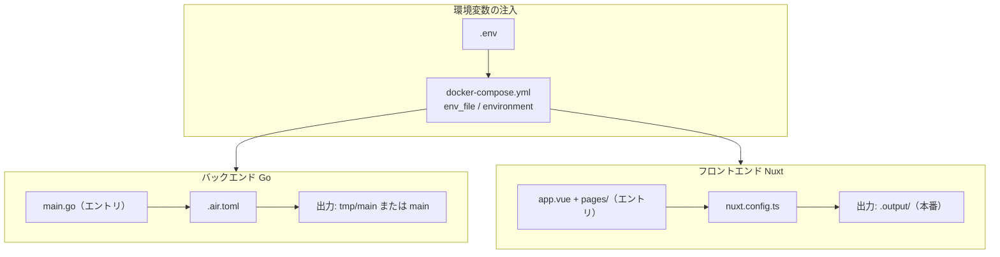
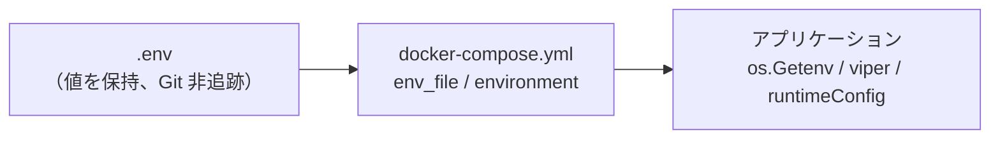
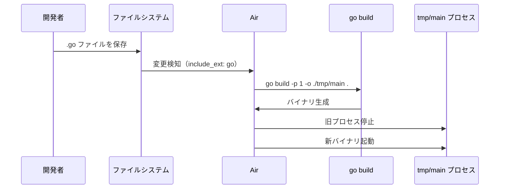
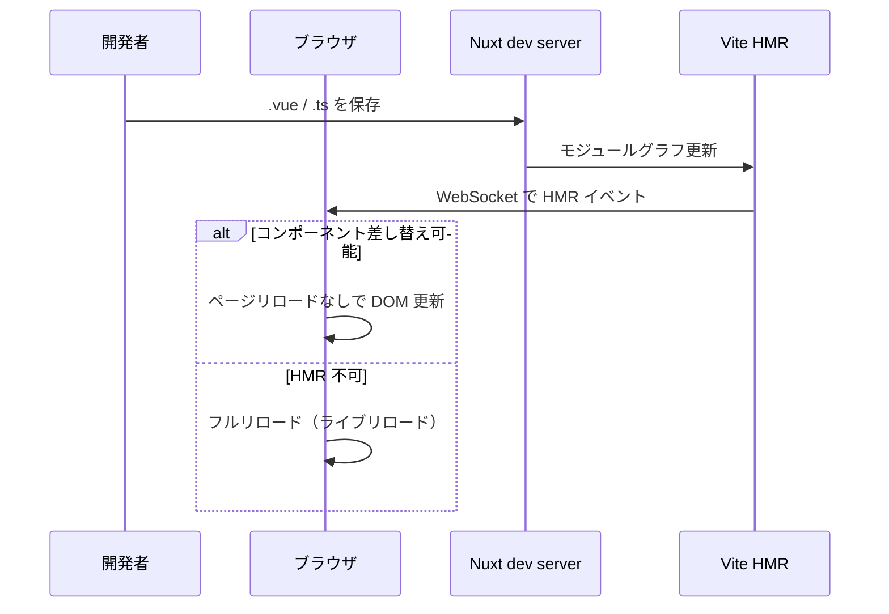

# ビルド設定ガイド

Run Sync Pro の **ビルド・起動・品質チェック** に関わる設定の説明です。  
面接やレビューで次の項目を説明できることを目的にまとめています。

| # | 評価項目 | 本ドキュメントの該当セクション |
|---|----------|-------------------------------|
| 1 | ビルド設定の基本項目を理解し、設定ファイルを編集できる | [§1 基本項目](#1-ビルド設定の基本項目) |
| 2 | エントリーポイント、出力先の設定 | [§2 エントリーポイントと出力先](#2-エントリーポイントと出力先) |
| 3 | 環境変数の注入 | [§3 環境変数の注入](#3-環境変数の注入) |
| 4 | 本番ビルド時の最適化（minify 等） | [§4 本番ビルドの最適化](#4-本番ビルドの最適化) |
| 5 | 開発時のホットリロード / ライブリロードの仕組み | [§5 ホットリロードとライブリロード](#5-ホットリロードとライブリロード) |

---

## 全体像



| レイヤ | 主な設定ファイル | 役割 |
|--------|------------------|------|
| 起動・連携 | `docker-compose.yml`, `.env` | サービス構成・ポート・環境変数注入 |
| バックエンド | `backend/Dockerfile`, `backend/.air.toml`, `backend/go.mod` | Go ビルド・ホットリロード |
| フロントエンド | `frontend/Dockerfile`, `frontend/package.json`, `frontend/nuxt.config.ts` | Nuxt ビルド・HMR・API 接続先 |
| 品質 | `Makefile`, `lefthook.yml`, `backend/.golangci.yml`, `.github/workflows/go-ci.yml` | テスト・lint・CI |

---

## 1. ビルド設定の基本項目

「ビルド設定」とは、**ソースコードをどうコンパイル・バンドルし、どこに出力し、どの環境変数で動かすか**を決める設定のことです。

### 1.1 設定ファイル一覧と編集ポイント

| ファイル | 編集すると変わること |
|----------|----------------------|
| `docker-compose.yml` | 起動するサービス、ポート、ボリューム、コンテナへの env 注入 |
| `.env` / `.env.example` | DB 接続先、ログレベル、Redis URL などの**値** |
| `backend/Dockerfile` | Go イメージ、ビルド時 env（`GOGC`）、起動コマンド（Air） |
| `backend/.air.toml` | 監視対象、ビルドコマンド、**出力バイナリのパス** |
| `backend/go.mod` | Go バージョン、依存パッケージ |
| `frontend/package.json` | `dev` / `build` / `preview` スクリプト |
| `frontend/nuxt.config.ts` | Nuxt モジュール、Vite 設定、**runtimeConfig（API URL）** |
| `frontend/Dockerfile` | Node バージョン、依存インストール、dev サーバー起動 |
| `Makefile` | ローカルの test / lint コマンド |
| `backend/.golangci.yml` | 有効な linter の種類と厳しさ |

### 1.2 Docker Compose の基本項目

`docker-compose.yml` は開発環境の**オーケストレーション**です。

| キー | 意味 | 例 |
|------|------|-----|
| `build.context` | ビルドコンテキスト（Dockerfile の COPY 基準） | `./backend` |
| `build.dockerfile` | 使う Dockerfile | `Dockerfile` / `Dockerfile.binary` |
| `ports` | `ホスト:コンテナ` のポートマッピング | `"8080:8080"` |
| `environment` | コンテナ内に注入する環境変数 | `REDIS_URL: redis://...` |
| `env_file` | 外部ファイルから env を読み込み | `.env` |
| `volumes` | ホストとコンテナのディレクトリ共有 | `./backend:/app` |
| `depends_on` | 起動順の依存 | `db`, `redis` |

**サービス一覧**

| サービス | ホストポート | ビルド元 |
|----------|--------------|----------|
| `db` | 5432 | `postgres:15-alpine` |
| `redis` | 6379 | `redis:7-alpine` |
| `backend` | 8080 | `./backend` → `Dockerfile` |
| `frontend` | 3001 → 3000 | `./frontend` → `Dockerfile` |
| `swagger-ui` | 8081 | `swaggerapi/swagger-ui` |

### 1.3 面接での説明例

> 「ビルド設定はレイヤごとに分かれています。インフラ層は `docker-compose.yml` と `.env`、Go は `Dockerfile` と `.air.toml`、フロントは `package.json` と `nuxt.config.ts` です。ポート変更なら compose、API 接続先なら `nuxt.config.ts` か `NUXT_PUBLIC_API_BASE`、Go のビルドコマンドなら `.air.toml` を編集します。」

---

## 2. エントリーポイントと出力先

### 2.1 バックエンド（Go）

#### エントリーポイント

| 用途 | ファイル | 説明 |
|------|----------|------|
| **API サーバー（本番・開発）** | `backend/main.go` | `func main()` が起動の入口。DB 接続 → Gin ルーター → HTTP サーバー起動 |
| 補助 CLI | `backend/cmd/tagcheck/main.go` | 構造体タグ検査用（`make go-tagcheck`） |

`go build` は **パッケージ直下の `main.go`** をエントリとして単一バイナリを生成します。  
モジュールパスは `backend/go.mod` の `module github.com/KENTA0326/run-sync-pro` です。

#### 出力先

| ビルド経路 | コマンド / 設定 | 出力ファイル |
|------------|-------------------|--------------|
| **開発（Air）** | `.air.toml` の `cmd` | `backend/tmp/main` |
| **ホストビルド（OOM 回避）** | `scripts/build-backend.sh` | `backend/main` |
| **ローカル手動** | `cd backend && go build -o bin/api .` | 任意（例: `bin/api`） |

```toml
# backend/.air.toml
[build]
  bin = "./tmp/main"
  cmd = "go build -p 1 -o ./tmp/main ."
```

`-o` が**出力先**、末尾の `.` が**ビルド対象パッケージ**（`main.go` を含むカレントディレクトリ）です。

#### 出力先を変えるには

1. `.air.toml` の `bin` と `cmd` の `-o` パスを揃えて変更
2. `scripts/build-backend.sh` の `-o main` を変更
3. `Dockerfile.binary` の `COPY main .` を新しいファイル名に合わせる

---

### 2.2 フロントエンド（Nuxt）

#### エントリーポイント

Nuxt 3/4 は **ファイルベースルーティング** で、明示の `index.html` エントリはありません。

| 役割 | ファイル / ディレクトリ |
|------|-------------------------|
| アプリのルート | `frontend/app.vue`（`<NuxtLayout>` / `<NuxtPage>`） |
| ページ | `frontend/pages/**/*.vue`（URL と 1:1） |
| 共通ロジック | `frontend/composables/`（例: `useApi.ts`） |
| 設定の入口 | `frontend/nuxt.config.ts` |

`package.json` の `"dev": "nuxt dev"` / `"build": "nuxt build"` が npm から Nuxt CLI への入口です。

#### 出力先

| コマンド | 出力ディレクトリ | 内容 |
|----------|------------------|------|
| `npm run dev` | メモリ上（`.nuxt/` に開発用キャッシュ） | 開発サーバー。成果物は永続ビルドではない |
| `npm run build` | `frontend/.output/` | 本番用サーバーバンドル（Nitro） |
| `npm run generate` | `frontend/.output/public/` 等 | 静的サイト（SSG） |

本番デプロイでは通常 `.output/` 全体をホストします（`node .output/server/index.mjs` や静的 CDN）。

#### 出力先を変えるには

Nuxt の出力先は `nuxt.config.ts` の `nitro.output` 等で変更可能です（現状はデフォルト `.output/` のまま）。

```typescript
// 例: 出力先を変更する場合
export default defineNuxtConfig({
  nitro: {
    output: { dir: '.output', serverDir: '.output/server' },
  },
})
```

---

### 2.3 一覧表（面接用）

| | バックエンド | フロントエンド |
|---|-------------|----------------|
| **エントリ** | `backend/main.go` | `app.vue` + `pages/` + `nuxt.config.ts` |
| **開発時の出力** | `backend/tmp/main` | `.nuxt/`（キャッシュ） |
| **本番時の出力** | 単一バイナリ `main` | `frontend/.output/` |
| **設定ファイル** | `.air.toml`, `go.mod` | `package.json`, `nuxt.config.ts` |

---

## 3. 環境変数の注入

環境変数は **「設定をコードにハードコードせず、実行環境ごとに差し替える」** ための仕組みです。  
本プロジェクトでは **3 段階** で注入します。



### 3.1 第 1 層: `.env` / `.env.example`

```bash
cp .env.example .env
# .env を編集（パスワード・接続先など）
```

- `.env.example` … キー名と説明のテンプレート（Git 管理）
- `.env` … 実際の値（**Git に含めない**）

### 3.2 第 2 層: Docker Compose による注入

```yaml
# docker-compose.yml（抜粋）
services:
  db:
    env_file: .env
    environment:
      POSTGRES_USER: ${POSTGRES_USER}
  backend:
    env_file: .env
    environment:
      DATABASE_URL: "postgres://${POSTGRES_USER}:..."
      REDIS_URL: "redis://redis:6379/0"
```

| 方法 | 用途 |
|------|------|
| `env_file: .env` | ファイル内のキーをまとめてコンテナに渡す |
| `environment:` | 明示的にキー・値を指定。`${VAR}` で `.env` を展開 |
| `docker compose up` 時のシェル env | ホストの export も `${VAR}` 展開に使われる |

**注入を追加する手順（バックエンド）**

1. `.env.example` にキーとコメントを追加
2. `.env` に値を書く
3. `docker-compose.yml` の `backend.environment` に追加（または `env_file` のみで足りる場合は 2 まで）
4. Go 側で読み取り（下記 §3.3）
5. `docker compose up -d --force-recreate backend` で反映

### 3.3 第 3 層: アプリケーション内での読み取り

#### バックエンド（Go）

本プロジェクトでは主に `internal/config.ResolveString`（viper ラッパー）と `os.Getenv` を使います。

```go
// internal/config/config.go — 優先順位: CLI引数 > 環境変数 > デフォルト
func ResolveString(cliValue, envKey, defaultValue string) string
```

| 環境変数 | 読み取り箇所 | 既定値 / 挙動 |
|----------|--------------|---------------|
| `DATABASE_URL` | `database/database.go` | compose 用 DSN / URL |
| `REDIS_URL` | `internal/cache/redis.go` | 空ならキャッシュ無効 |
| `LOG_LEVEL` / `LOG_FORMAT` / `LOG_SOURCE` | `internal/logging/init.go` | `info` / `json` / `false` |
| `GRPC_PORT` | `main.go` | 空なら gRPC 起動しない |
| `EXTERNAL_API_*` | `internal/httpclient/env.go` | 外部 API クライアント |
| `ANALYSIS_CACHE_TTL_SEC` | 分析キャッシュ | 既定 300 秒 |

`main.go` の起動順:

```go
logging.InitFromEnv()          // LOG_* を読む
database.Connect()             // DATABASE_URL
cache.ConnectRedisFromEnv()    // REDIS_URL
```

#### フロントエンド（Nuxt）

`nuxt.config.ts` の `runtimeConfig` と **環境変数の自動マッピング** を使います。

```typescript
// nuxt.config.ts
runtimeConfig: {
  public: {
    apiBase: 'http://localhost:8080',  // 既定値
  },
},
```

| 環境変数 | マッピング先 | 公開範囲 |
|----------|--------------|----------|
| `NUXT_PUBLIC_API_BASE` | `runtimeConfig.public.apiBase` | ブラウザに露出 OK |

`NUXT_PUBLIC_` プレフィックス付きの変数だけがクライアントに送られます。秘密情報は **`NUXT_PUBLIC_` を付けない**（サーバー専用 `runtimeConfig` のみ）。

実際の利用:

```typescript
// composables/useApi.ts
const config = useRuntimeConfig()
const baseURL = resolveApiBase(config.public.apiBase)
```

#### Docker Compose でフロントに渡す例

```yaml
services:
  frontend:
    environment:
      - NUXT_PUBLIC_API_BASE=http://localhost:8080
```

### 3.4 環境ごとの差し替え

| 環境 | 注入元の例 |
|------|------------|
| ローカル Docker | `.env` + `docker-compose.yml` |
| ローカル直接実行 | シェルの `export DATABASE_URL=...` |
| CI | `.github/workflows/go-ci.yml` の `env:` |
| 本番（想定） | K8s Secret / AWS SSM / ホスティングの env 設定 |

### 3.5 面接での説明例

> 「`.env` に値を書き、Compose の `env_file` と `environment` でコンテナに渡し、アプリは viper や `useRuntimeConfig` で読みます。フロントの公開設定は `NUXT_PUBLIC_` プレフィックスでビルド時に埋め込み、バックエンドの DB URL は `DATABASE_URL` で起動時に解決します。秘密情報は `.env` のみに置き、Git には載せません。」

---

## 4. 本番ビルドの最適化

開発ビルドは**速さ・フィードバック**優先、本番ビルドは**サイズ・性能・セキュリティ**優先です。

### 4.1 バックエンド（Go）

#### 現状のビルド

```bash
# 開発（Air 経由）
go build -p 1 -o ./tmp/main .

# OOM 回避スクリプト
GOOS=linux GOARCH=arm64 go build -p 1 -o main .
```

#### 本番で一般的な最適化フラグ

| 手法 | フラグ / 設定 | 効果 |
|------|---------------|------|
| デバッグ情報削除 | `-ldflags="-s -w"` | バイナリサイズ縮小 |
| 静的リンク | `CGO_ENABLED=0` | ポータブルな単一バイナリ |
| 不要コード除去 | コンパイラのデッドコード除去（既定で有効） | 未使用パッケージをリンクしない |
| 並列ビルド | `-p N` | ビルド時間短縮（CI 向け。開発 Docker では OOM のため `-p 1`） |
| トリムパス | `-trimpath` | ビルドマシンのパスをバイナリに含めない |

**本番ビルド例（推奨パターン）**

```bash
CGO_ENABLED=0 GOOS=linux GOARCH=amd64 \
  go build -trimpath -ldflags="-s -w" -o dist/run-sync-api .
```

現状のリポジトリには上記 ldflags は**未適用**です。`scripts/build-backend.sh` に追加するのが自然な拡張ポイントです。

#### Docker 本番イメージ（現状）

`Dockerfile.binary` は **ビルド済みバイナリのみ** を Alpine に載せる最小構成です。

```dockerfile
FROM alpine:3.19
COPY main .
CMD ["./main"]
```

コンパイルはホスト側で行うため、イメージに Go ツールチェーンが入らず軽量です。

---

### 4.2 フロントエンド（Nuxt / Vite）

#### 本番ビルドコマンド

```bash
cd frontend
npm run build    # 内部で nuxt build → Vite 本番モード
npm run preview  # ビルド結果の確認
```

#### Nuxt / Vite が既定で行う最適化

| 最適化 | 説明 | 本プロジェクト |
|--------|------|----------------|
| **Minify（JS/CSS）** | 変数名短縮・空白削除 | `nuxt build` で**自動有効**（Vite 本番モード） |
| **Tree shaking** | 未使用 export の除去 | 自動 |
| **Code splitting** | ルート単位のチャンク分割 | Nuxt のページベースで自動 |
| **アセットハッシュ** | キャッシュバスティング | `.output/` 内ファイル名にハッシュ |
| **依存の事前バンドル** | 開発時の cold start 改善 | `nuxt.config.ts` の `vite.optimizeDeps.include` |

```typescript
// frontend/nuxt.config.ts（現状）
vite: {
  optimizeDeps: {
    include: ['chart.js', 'vue-chartjs'],
  },
},
```

#### 追加で設定できる最適化（任意）

```typescript
export default defineNuxtConfig({
  vite: {
    build: {
      minify: 'esbuild',       // 既定。'terser' に変更も可
      cssMinify: true,
      rollupOptions: {
        output: {
          manualChunks: {       // 大きいライブラリを手動チャンク化
            charts: ['chart.js', 'vue-chartjs'],
          },
        },
      },
    },
  },
})
```

現状は **Vite のデフォルト最適化に任せており**、上記の明示的 minify 設定は入れていません。

#### 開発 vs 本番の違い

| 項目 | `npm run dev` | `npm run build` |
|------|---------------|-----------------|
| Minify | なし | あり |
| Source map | 詳細 | 本番用（設定次第） |
| HMR | 有効 | なし |
| 出力 | メモリ + `.nuxt/` | `.output/` |

---

### 4.3 面接での説明例

> 「フロントは `nuxt build` で Vite の本番モードが走り、JS/CSS の minify と tree shaking が自動でかかります。Go はコンパイル型なので minify の概念はなく、代わりに `-ldflags="-s -w"` でデバッグシンボルを落としてサイズを削ります。開発 Docker では OOM を避けるため `GOMAXPROCS=1` と `-p 1` でビルドを絞り、本番 CI では並列と ldflags を使い分ける想定です。」

---

## 5. ホットリロードとライブリロード

### 5.1 用語の整理

| 用語 | 意味 |
|------|------|
| **ホットリロード** | 変更を検知してアプリを再起動 or モジュール差し替え（開発用） |
| **ライブリロード** | ブラウザが自動でページを再読み込み |
| **HMR（Hot Module Replacement）** | **ページ全体をリロードせず**、変更したモジュールだけを差し替え |

---

### 5.2 バックエンド: Air によるホットリロード



| 設定 | ファイル | 内容 |
|------|----------|------|
| 監視対象 | `.air.toml` `include_ext` | `go`, `tpl`, ... |
| 除外 | `exclude_dir` | `tmp`, `vendor` |
| ビルド | `cmd` | `go build -p 1 -o ./tmp/main .` |
| 実行 | `bin` | `./tmp/main` |
| 起動 | `Dockerfile` `CMD` | `air -c .air.toml` |

**ポイント**

- Go はインタプリタ型ではないため、**プロセスごと再起動**（再ビルド → 再実行）
- `docker-compose.yml` の `./backend:/app` マウントで、ホストの保存がコンテナ内に即反映
- `delay = 1000`（ms）で連続保存時のビルド暴発を抑制

**ホットリロードが効かない経路**

`docker-compose.binary.yml` + `Dockerfile.binary` ではソースをマウントしないため、**コード変更のたびに `build-backend.sh` の再実行が必要**です。

---

### 5.3 フロントエンド: Nuxt dev + Vite HMR



| 設定 | 内容 |
|------|------|
| 起動 | `npm run dev` / Docker `CMD ["npm", "run", "dev", "--", "--host", "0.0.0.0"]` |
| ポート | コンテナ 3000 → ホスト 3001 |
| マウント | `./frontend:/src` + `/src/node_modules` 匿名ボリューム |

**ポイント**

- `.vue` コンポーネント変更は多くの場合 **HMR**（状態を保ったまま UI 更新）
- `nuxt.config.ts` 変更などは **サーバー再起動** が必要
- CSS（Tailwind 含む）は通常 **ライブリロードなし**でスタイルだけ更新
- `--host 0.0.0.0` により Docker 外のブラウザから `localhost:3001` でアクセス可能

---

### 5.4 開発 vs 本番（リロードの有無）

| | 開発 | 本番 |
|---|------|------|
| バックエンド | Air が変更検知 → 再ビルド → 再起動 | バイナリ固定。変更は再デプロイ |
| フロントエンド | Vite HMR / ライブリロード | 静的アセット配信のみ。HMR なし |

### 5.5 面接での説明例

> 「バックエンドは Air が `*.go` の変更を監視し、`go build` して `tmp/main` を再起動します。フル再起動ですが、Docker のボリュームマウントと組み合わせて開発体験を保っています。フロントは Nuxt dev が Vite の HMR を使い、Vue コンポーネントは可能な限りページリロードなしで差し替えます。本番ではどちらもホットリロードは使わず、ビルド済み成果物を配信します。」

---

## 6. 品質チェック・CI

### `Makefile`

| ターゲット | 内容 |
|------------|------|
| `make go-fmt` | `gofmt -w` |
| `make go-test` | `go test -race ./...` |
| `make go-lint` | `golangci-lint run` |
| `make go-ci` | 上記まとめて実行 |

### `.github/workflows/go-ci.yml`

- トリガー: `backend/**` 変更時
- PostgreSQL サービス付きテスト、マイグレーション可逆性、`golangci-lint`
- フロントの `npm run build` CI は**現状なし**

### `lefthook.yml`

コミット前に `gofmt` + `golangci-lint`（`lefthook install` が必要）

---

## 7. よくある編集シナリオ

| やりたいこと | 触るファイル |
|--------------|--------------|
| API ポート変更 | `docker-compose.yml`, `NUXT_PUBLIC_API_BASE`, `docs/openapi.yaml` |
| 新しい backend env 追加 | `.env.example`, `.env`, `docker-compose.yml`, Go の読み取りコード |
| バイナリ出力先変更 | `.air.toml`, `scripts/build-backend.sh`, `Dockerfile.binary` |
| 本番 Go ビルド最適化 | `scripts/build-backend.sh` に `-ldflags="-s -w" -trimpath` |
| フロントのチャンク分割 | `nuxt.config.ts` の `vite.build.rollupOptions` |
| Docker OOM 回避 | [docker-memory.md](./docker-memory.md) |
| Swagger UI のみ起動 | `docker compose up swagger-ui -d` → [openapi.md](./openapi.md) |

---

## 8. 設定ファイル早見表

```
run-sync-pro/
├── docker-compose.yml          # サービス・ポート・env 注入・ボリューム
├── docker-compose.binary.yml   # OOM 時 backend 差し替え（HMR なし）
├── .env / .env.example         # 環境変数の値 / テンプレート
├── Makefile                    # go test / lint
├── lefthook.yml                # pre-commit
├── scripts/build-backend.sh    # エントリ main.go → 出力 backend/main
├── .github/workflows/go-ci.yml # CI（env 注入例）
├── backend/
│   ├── main.go                 # ★ エントリーポイント
│   ├── Dockerfile              # 開発: Air 起動
│   ├── Dockerfile.binary       # 本番寄り: バイナリのみ COPY
│   ├── .air.toml               # ★ 出力 tmp/main、ホットリロード
│   ├── .golangci.yml
│   └── go.mod
└── frontend/
    ├── app.vue                 # ★ アプリルート
    ├── pages/                  # ページ（ルート）
    ├── Dockerfile              # nuxt dev
    ├── package.json            # dev / build スクリプト
    └── nuxt.config.ts          # ★ runtimeConfig、Vite 最適化
```

---

## 関連ドキュメント

- [docker-memory.md](./docker-memory.md) … Docker OOM とバイナリビルド
- [migrations.md](./migrations.md) … DB マイグレーション
- [openapi.md](./openapi.md) … API 仕様の表示
- [private-module-semver.md](./private-module-semver.md) … モジュールバージョン運用
